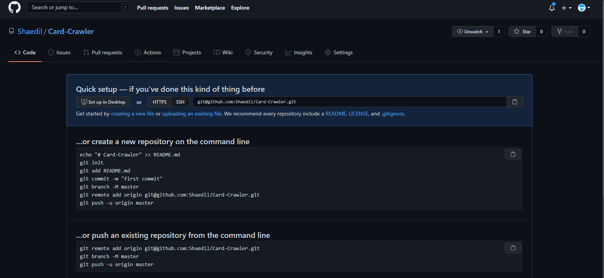

<!-- ┌─────────────┐ -->
<!-- │Term Project │ -->
<!-- └─────────────┘ -->
<!-- ┌──────────────┐ -->
<!-- │D&D Card Game │ -->
<!-- └──────────────┘ -->
# 15-112 Term Project - Card Crawler

## Project Description

Card Crawler is an original card-based dungeon crawler game created by me. The goal of the game is to find the hidden treasure in the dungeon by traversing through the rooms that are represented by playing cards. Certain rooms grant certain abilities to the player. For instance, landing on hearts allows the player to rest. Landing on diamonds however, immediately puts the player into combat. In combat, the player has a number of special cards that allow the player to heal, fight, get more cards, and defend. The enemy will attack, defend, and heal when possible.

## Structural Plan

- one function to create the overworld map.
  - generating a legal maze
  - difficulty level controlled by probability of spawning rest cards
- one class to control the player and movement throughout the map
- one class to control Player cards: `heal, shield, coin, sword`
- one function to create the room map, based on the 4 preset suits of card: `hearts, spades, diamonds, clubs`
  - `hearts`: do nothing/rest = hide all map cards and rearrange them but you get to draw two new cards
  - `spades`: trick choice: discard entire hand for new cards, choose a map card to reveal, move one map card to another place of choosing.
  - `diamonds`: enemy with health denoted by card number
  - `clubs`: treasure/exit
- ~~one class to play original music in each room~~**
- one function in Player class for displaying player cards
- one function in Map class for displaying map cards
- ~~one class for displaying animated transitions~~**
- ~~two functions to display splash screen/rules~~**
- one class for enemy and enemy ai (shielding/attacking/buffing)

** Will be done last, if not, at all.

## Algorithmic Plan

- Trickiest parts of the project (in order of high complexity to low complexity)
  - Implementing legal maze generation
    - Approach: Krimskal's algorithm or random assignment of rooms
  - Implementing enemy AI
    - Approach: analysis of player's actions
  - Implementing reactive ui elements
    - Approach: mousePressed w/ object detection (standard)

## Version Control Plan

- I will be using GitHub for my versioning control

